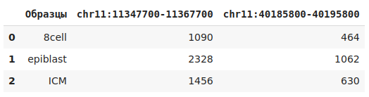
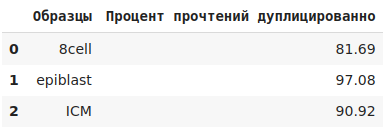
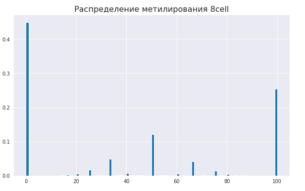
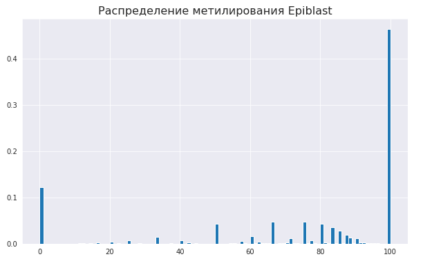
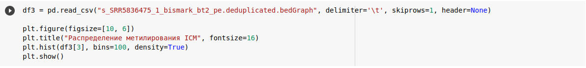

# hse_hw1_meth

## 2.
### a)

### b)

Скрипт находится в /scr/duplicate_all.sh

### c)

Done. 1.5 часа, мда...

### d)
Отчеты в /html.

### e)

Код построения гистограммы(пример c ICM):

### f)
Митилирование:

Покрытие:

