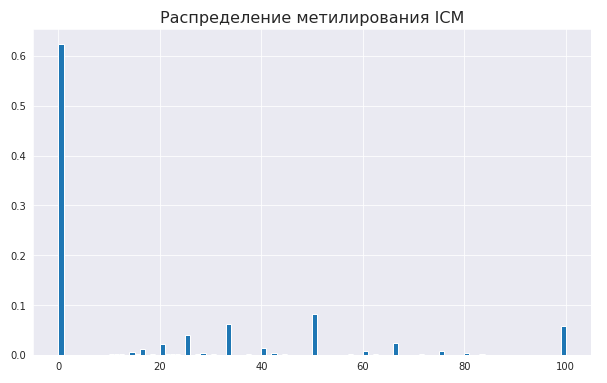

# hse_hw1_meth

Ссылка на Colab: https://colab.research.google.com/drive/1NythSDWdjgvl8WtRStkHupEtXQn3Htz5?usp=sharing

## 1.

### 1)
Все fastqc файлы лежат в одноименной папке /fastqc

(1 картинка - какой-то секвенирование RNA с прошлой дз, 2 картинка - SRR5836473_1, 3 картинка - SRR5836473_2)

  
  
  

из этих картинок делаем вывод, что к концу секвенирования митилирование - падает quality score

### 

## 2.
### a)

### b)

Скрипт находится в /scr/duplicate_all.sh

### c)

Done. 1.5 часа, мда...

### d)
Отчеты в /html.

### e)

Код построения гистограммы(пример c ICM):

### f)
Митилирование:

Покрытие:

